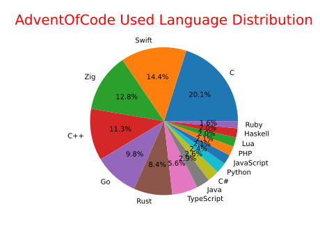

# Advent Of Code

This repository contains my solutions for the [Advent of Code](https://adventofcode.com/) challenges.
Each year has its own folder, and each day has its own folder within that.

I have multiple solution with different languages. Each language on its own folder.

**Note:** I'm not trying to be the fastest or the most efficient, I'm just trying to have fun and learn something new.

## Language Distribution

`Important: The language distribution does not include the CMake and Make build systems languages`

## Languages

| Year            | Languages                                                                                                                                                                                                                                                                                                                                                             |
| --------------- | --------------------------------------------------------------------------------------------------------------------------------------------------------------------------------------------------------------------------------------------------------------------------------------------------------------------------------------------------------------------- |
| [`2015`](#2015) | [`C`](./2015/c) [`C#`](./2015/c#/) [`C++`](./2015/c++/) [`Go`](./2015/go/) [`Haskell`](./2015/haskell/) [`Java`](./2015/java/) [`Javascript`](./2015/javascript/) [`Lua`](./2015/lua/) [`Php`](./2015/php/) [`Python`](./2015/python/) [`Ruby`](./2015/ruby/) [`Rust`](./2015/rust/) [`Swift`](./2015/swift/) [`Typescript`](./2015/typescript/) [`Zig`](./2015/zig/) |
| [`2016`](#2016) | [`C`](./2016/c) [`C++`](./2016/c++/)                                                                                                                                                                                                                                                                                                                                  |
| [`2017`](#2017) | [`Zig`](./2017/zig/) [`Rust`](./2017/rust/)                                                                                                                                                                                                                                                                                                                           |
| [`2018`](#2018) | [`Go`](./2018/go/)                                                                                                                                                                                                                                                                                                                                                    |
| [`2019`](#2019) | [`Swift`](./2019/swift)                                                                                                                                                                                                                                                                                                                                               |
| [`2020`](#2020) | [`Zig`](./2020/zig/)                                                                                                                                                                                                                                                                                                                                                  |

## 2015

### Problems

| Problems                                                                             |
| :----------------------------------------------------------------------------------- |
| [Day 1: Not Quite List](https://adventofcode.com/2015/day/1)                         |
| [Day 2: I Was Told There Would Be No Math](https://adventofcode.com/2015/day/2)      |
| [Day 3: Perfectly Spherical Houses in a Vacuum](https://adventofcode.com/2015/day/3) |
| [Day 4: The Ideal Stocking Stuffer](https://adventofcode.com/2015/day/4)             |
| [Day 5: Doesn't He Have Intern-Elves For This?](https://adventofcode.com/2015/day/5) |
| [Day 6: Probably a Fire Hazard](https://adventofcode.com/2015/day/6)                 |
| [Day 7: Some Assembly Required](https://adventofcode.com/2015/day/7)                 |
| [Day 8: Matchsticks](https://adventofcode.com/2015/day/8)                            |
| [Day 9: All in a Single Night](https://adventofcode.com/2015/day/9)                  |
| [Day 10: Elves Look, Elves Say](https://adventofcode.com/2015/day/10)                |
| [Day 11: Corporate Policy](https://adventofcode.com/2015/day/11)                     |
| [Day 12: JSAbacusFramework.io](https://adventofcode.com/2015/day/12)                 |
| [Day 13: Knights of the Dinner Table](https://adventofcode.com/2015/day/13)          |
| [Day 14: Reindeer Olympics](https://adventofcode.com/2015/day/14)                    |
| [Day 15: Science for Hungry People](https://adventofcode.com/2015/day/15)            |
| [Day 16: Aunt Sue](https://adventofcode.com/2015/day/16)                             |
| [Day 17: No Such Thing as Too Much](https://adventofcode.com/2015/day/17)            |
| [Day 18: Like a GIF For Your Yard](https://adventofcode.com/2015/day/18)             |
| [Day 19: Medicine for Rudolph](https://adventofcode.com/2015/day/19)                 |
| [Day 20: Infinite Elves and Infinite Houses](https://adventofcode.com/2015/day/20)   |
| [Day 21: RPG Simulator 20XX](https://adventofcode.com/2015/day/21)                   |
| [Day 22: Wizard Simulator 20XX](https://adventofcode.com/2015/day/22)                |
| [Day 23: Opening the Turing Lock](https://adventofcode.com/2015/day/23)              |
| [Day 24: It Hangs in the Balance](https://adventofcode.com/2015/day/24)              |
| [Day 25: Let It Snow](https://adventofcode.com/2015/day/25)                          |

### Solutions

| Language     | Days                                                                                                                                                                                                                                                                                                                                                                                                                                                                                                                       |
| ------------ | -------------------------------------------------------------------------------------------------------------------------------------------------------------------------------------------------------------------------------------------------------------------------------------------------------------------------------------------------------------------------------------------------------------------------------------------------------------------------------------------------------------------------- |
| `C`          | [`1`](./2015/c/1/) [`2`](./2015/c/2/) [`3`](./2015/c/3/) [`4`](./2015/c/4/) [`5`](./2015/c/5/) [`6`](./2015/c/6/) [`7`](./2015/c/7/) [`8`](./2015/c/8/) [`9`](./2015/c/9/) [`10`](./2015/c/10/) [`11`](./2015/c/11/) [`12`](./2015/c/12/) [`13`](./2015/c/13/) [`14`](./2015/c/14/) [`15`](./2015/c/15/) [`16`](./2015/c/16/) [`17`](./2015/c/17/) [`18`](./2015/c/18/) [`19`](./2015/c/19/) [`20`](./2015/c/20/) [`21`](./2015/c/21/) [`22`](./2015/c/22/) [`23`](./2015/c/23/) [`24`](./2015/c/24/) [`25`](./2015/c/25/) |
| `C#`         | [`1`](./2015/c#/1/) [`2`](./2015/c#/2/) [`3`](./2015/c#/3/) [`4`](./2015/c#/4/) [`5`](./2015/c#/5/) [`6`](./2015/c#/6/) [`7`](./2015/c#/7/) [`8`](./2015/c#/8/)                                                                                                                                                                                                                                                                                                                                                            |
| `C++`        | [`1`](./2015/c++/1/) [`2`](./2015/c++/2/) [`3`](./2015/c++/3/) [`4`](./2015/c++/4/) [`5`](./2015/c++/5/) [`6`](./2015/c++/6/) [`7`](./2015/c++/7/) [`8`](./2015/c++/8/)                                                                                                                                                                                                                                                                                                                                                    |
| `Go`         | [`1`](./2015/go/1/) [`2`](./2015/go/2/) [`3`](./2015/go/3/) [`4`](./2015/go/4/) [`5`](./2015/go/5/) [`6`](./2015/go/6/) [`7`](./2015/go/7/) [`8`](./2015/go/8/)                                                                                                                                                                                                                                                                                                                                                            |
| `Haskell`    | [`1`](./2015/haskell/1/) [`2`](./2015/haskell/2/) [`3`](./2015/haskell/3/) [`4`](./2015/haskell/4/) [`5`](./2015/haskell/5/) [`6`](./2015/haskell/6/) [`7`](./2015/haskell/7/) [`8`](./2015/haskell/8/)                                                                                                                                                                                                                                                                                                                    |
| `Java`       | [`1`](./2015/java/1/) [`2`](./2015/java/2/) [`3`](./2015/java/3/) [`4`](./2015/java/4/) [`5`](./2015/java/5/) [`6`](./2015/java/6/) [`7`](./2015/java/7/) [`8`](./2015/java/8/)                                                                                                                                                                                                                                                                                                                                            |
| `Javascript` | [`1`](./2015/javascript/1/) [`2`](./2015/javascript/2/) [`3`](./2015/javascript/3/) [`4`](./2015/javascript/4/) [`5`](./2015/javascript/5/) [`6`](./2015/javascript/6/) [`7`](./2015/javascript/7/) [`8`](./2015/javascript/8/)                                                                                                                                                                                                                                                                                            |
| `Lua`        | [`1`](./2015/lua/1/) [`2`](./2015/lua/2/) [`3`](./2015/lua/3/) [`4`](./2015/lua/4/) [`5`](./2015/lua/5/) [`6`](./2015/lua/6/) [`7`](./2015/lua/7/) [`8`](./2015/lua/8/)                                                                                                                                                                                                                                                                                                                                                    |
| `Php`        | [`1`](./2015/php/1/) [`2`](./2015/php/2/) [`3`](./2015/php/3/) [`4`](./2015/php/4/) [`5`](./2015/php/5/) [`6`](./2015/php/6/) [`7`](./2015/php/7/) [`8`](./2015/php/8/)                                                                                                                                                                                                                                                                                                                                                    |
| `Python`     | [`1`](./2015/python/1/) [`2`](./2015/python/2/) [`3`](./2015/python/3/) [`4`](./2015/python/4/) [`5`](./2015/python/5/) [`6`](./2015/python/6/) [`7`](./2015/python/7/) [`8`](./2015/python/8/)                                                                                                                                                                                                                                                                                                                            |
| `Ruby`       | [`1`](./2015/ruby/1/) [`2`](./2015/ruby/2/) [`3`](./2015/ruby/3/) [`4`](./2015/ruby/4/) [`5`](./2015/ruby/5/) [`6`](./2015/ruby/6/) [`7`](./2015/ruby/7/) [`8`](./2015/ruby/8/)                                                                                                                                                                                                                                                                                                                                            |
| `Rust`       | [`1`](./2015/rust/1/) [`2`](./2015/rust/2/) [`3`](./2015/rust/3/) [`4`](./2015/rust/4/) [`5`](./2015/rust/5/) [`6`](./2015/rust/6/) [`7`](./2015/rust/7/) [`8`](./2015/rust/8/)                                                                                                                                                                                                                                                                                                                                            |
| `Swift`      | [`1`](./2015/swift/1/) [`2`](./2015/swift/2/) [`3`](./2015/swift/3/) [`4`](./2015/swift/4/) [`5`](./2015/swift/5/) [`6`](./2015/swift/6/) [`7`](./2015/swift/7/)                                                                                                                                                                                                                                                                                                                                                           |
| `Typescript` | [`1`](./2015/typescript/1/) [`2`](./2015/typescript/2/) [`3`](./2015/typescript/3/) [`4`](./2015/typescript/4/) [`5`](./2015/typescript/5/) [`6`](./2015/typescript/6/) [`7`](./2015/typescript/7/)                                                                                                                                                                                                                                                                                                                        |
| `Zig`        | [`1`](./2015/zig/1/) [`2`](./2015/zig/2/) [`3`](./2015/zig/3/) [`4`](./2015/zig/4/) [`5`](./2015/zig/5/) [`6`](./2015/zig/6/) [`7`](./2015/zig/7/)                                                                                                                                                                                                                                                                                                                                                                         |

## 2016

### Problems

| Problems                                                                               |
| :------------------------------------------------------------------------------------- |
| [Day 1: No Time for a Taxicab](https://adventofcode.com/2016/day/1)                    |
| [Day 2: Bathroom Security](https://adventofcode.com/2016/day/2)                        |
| [Day 3: Squares With Three Sides](https://adventofcode.com/2016/day/3)                 |
| [Day 4: Security Through Obscurity](https://adventofcode.com/2016/day/4)               |
| [Day 5: How About a Nice Game of Chess?](https://adventofcode.com/2016/day/5)          |
| [Day 6: Signals and Noise](https://adventofcode.com/2016/day/6)                        |
| [Day 7: Internet Protocol Version 7](https://adventofcode.com/2016/day/7)              |
| [Day 8: Two-Factor Authentication](https://adventofcode.com/2016/day/8)                |
| [Day 9: Explosives in Cyberspace](https://adventofcode.com/2016/day/9)                 |
| [Day 10: Balance Bots](https://adventofcode.com/2016/day/10)                           |
| [Day 11: Radioisotope Thermoelectric Generators](https://adventofcode.com/2016/day/11) |
| [Day 12: Leonardo's Monorail](https://adventofcode.com/2016/day/12)                    |
| [Day 13: A Maze of Twisty Little Cubicles](https://adventofcode.com/2016/day/13)       |
| [Day 14: One-Time Pad](https://adventofcode.com/2016/day/14)                           |
| [Day 15: Timing is Everything](https://adventofcode.com/2016/day/15)                   |
| [Day 16: Dragon Checksum](https://adventofcode.com/2016/day/16)                        |
| [Day 17: Two Steps Forward](https://adventofcode.com/2016/day/17)                      |
| [Day 18: Like a Rogue](https://adventofcode.com/2016/day/18)                           |
| [Day 19: An Elephant Named Joseph](https://adventofcode.com/2016/day/19)               |
| [Day 20: Firewall Rules](https://adventofcode.com/2016/day/20)                         |
| [Day 21: Scrambled Letters and Hash](https://adventofcode.com/2016/day/21)             |
| [Day 22: Grid Computing](https://adventofcode.com/2016/day/22)                         |
| [Day 23: Safe Cracking](https://adventofcode.com/2016/day/23)                          |
| [Day 24: Air Duct Spelunking](https://adventofcode.com/2016/day/24)                    |
| [Day 25: Clock Signal](https://adventofcode.com/2016/day/25)                           |

### Solutions

| Language | Days                                                                                                                                                                                                                                                                                                                                                                                                                                                                                                                                                                         |
| -------- | ---------------------------------------------------------------------------------------------------------------------------------------------------------------------------------------------------------------------------------------------------------------------------------------------------------------------------------------------------------------------------------------------------------------------------------------------------------------------------------------------------------------------------------------------------------------------------- |
| `C`      | [`1`](./2016/c/1/)                                                                                                                                                                                                                                                                                                                                                                                                                                                                                                                                                           |
| `C++`    | [`1`](./2016/c++/1/) [`2`](./2016/c++/2/) [`3`](./2016/c++/3/) [`4`](./2016/c++/4/) [`5`](./2016/c++/5/) [`6`](./2016/c++/6/) [`7`](./2016/c++/7/) [`8`](./2016/c++/8/) [`9`](./2016/c++/9/) [`10`](./2016/c++/10/) [`11`](./2016/c++/11/) [`12`](./2016/c++/12/) [`13`](./2016/c++/13/) [`14`](./2016/c++/14/) [`15`](./2016/c++/15/) [`16`](./2016/c++/16/) [`17`](./2016/c++/17/) [`18`](./2016/c++/18/) [`19`](./2016/c++/19/) [`20`](./2016/c++/20/) [`21`](./2016/c++/21/) [`22`](./2016/c++/22/) [`23`](./2016/c++/23/) [`24`](./2016/c++/24/) [`25`](./2016/c++/25/) |

## 2017

### Problems

| Problems                                                                              |
| :------------------------------------------------------------------------------------ |
| [Day 1: Inverse Captcha](https://adventofcode.com/2017/day/1)                         |
| [Day 2: Corruption Checksum](https://adventofcode.com/2017/day/2)                     |
| [Day 3: Spiral Memory](https://adventofcode.com/2017/day/3)                           |
| [Day 4: High-Entropy Passphrases](https://adventofcode.com/2017/day/4)                |
| [Day 5: A Maze of Twisty Trampolines, All Alike](https://adventofcode.com/2017/day/5) |
| [Day 6: Memory Reallocation](https://adventofcode.com/2017/day/6)                     |
| [Day 7: Recursive Circus](https://adventofcode.com/2017/day/7)                        |
| [Day 8: I Heard You Like Registers](https://adventofcode.com/2017/day/8)              |
| [Day 9: Stream Processing](https://adventofcode.com/2017/day/9)                       |
| [Day 10: Knot Hash](https://adventofcode.com/2017/day/10)                             |
| [Day 11: Hex Ed](https://adventofcode.com/2017/day/11)                                |
| [Day 12: Digital Plumber](https://adventofcode.com/2017/day/12)                       |
| [Day 13: Packet Scanners](https://adventofcode.com/2017/day/13)                       |
| [Day 14: Disk Defragmentation](https://adventofcode.com/2017/day/14)                  |
| [Day 15: Dueling Generators](https://adventofcode.com/2017/day/15)                    |
| [Day 16: Permutation Promenade](https://adventofcode.com/2017/day/16)                 |
| [Day 17: Spinlock](https://adventofcode.com/2017/day/17)                              |
| [Day 18: Duet](https://adventofcode.com/2017/day/18)                                  |
| [Day 19: A Series of Tubes](https://adventofcode.com/2017/day/19)                     |
| [Day 20: Particle Swarm](https://adventofcode.com/2017/day/20)                        |
| [Day 21: Fractal Art](https://adventofcode.com/2017/day/21)                           |
| [Day 22: Sporifica Virus](https://adventofcode.com/2017/day/22)                       |
| [Day 23: Coprocessor Conflagration](https://adventofcode.com/2017/day/23)             |
| [Day 24: Electromagnetic Moat](https://adventofcode.com/2017/day/24)                  |
| [Day 25: The Halting Problem](https://adventofcode.com/2017/day/25)                   |

### Solutions

| Language | Days                                                                                                                                                                                                                                                                                                                                                                                                                                                                                                                                                                                                  |
| -------- | ----------------------------------------------------------------------------------------------------------------------------------------------------------------------------------------------------------------------------------------------------------------------------------------------------------------------------------------------------------------------------------------------------------------------------------------------------------------------------------------------------------------------------------------------------------------------------------------------------- |
| `Zig`    | [`1`](./2017/zig/1/)                                                                                                                                                                                                                                                                                                                                                                                                                                                                                                                                                                                  |
| `Rust`   | [`1`](./2017/rust/1/) [`2`](./2017/rust/2/) [`3`](./2017/rust/3/) [`4`](./2017/rust/4/) [`5`](./2017/rust/5/) [`6`](./2017/rust/6/) [`7`](./2017/rust/7/) [`8`](./2017/rust/8/) [`9`](./2017/rust/9/) [`10`](./2017/rust/10/) [`11`](./2017/rust/11/) [`12`](./2017/rust/12/) [`13`](./2017/rust/13/) [`14`](./2017/rust/14/) [`15`](./2017/rust/15/) [`16`](./2017/rust/16/) [`17`](./2017/rust/17/) [`18`](./2017/rust/18/) [`19`](./2017/rust/19/) [`20`](./2017/rust/20/) [`21`](./2017/rust/21/) [`22`](./2017/rust/22/) [`23`](./2017/rust/23/) [`24`](./2017/rust/24/) [`25`](./2017/rust/25/) |

## 2018

### Problems

| Problems                                                                             |
| :----------------------------------------------------------------------------------- |
| [Day 1: Chronal Calibration](https://adventofcode.com/2018/day/1)                    |
| [Day 2: Inventory Management System](https://adventofcode.com/2018/day/2)            |
| [Day 3: No Matter How You Slice It](https://adventofcode.com/2018/day/3)             |
| [Day 4: Repose Record](https://adventofcode.com/2018/day/4)                          |
| [Day 5: Alchemical Reduction](https://adventofcode.com/2018/day/5)                   |
| [Day 6: Chronal Coordinates](https://adventofcode.com/2018/day/6)                    |
| [Day 7: The Sum of Its Parts](https://adventofcode.com/2018/day/7)                   |
| [Day 8: Memory Maneuver](https://adventofcode.com/2018/day/8)                        |
| [Day 9: Marble Mania](https://adventofcode.com/2018/day/9)                           |
| [Day 10: The Stars Align](https://adventofcode.com/2018/day/10)                      |
| [Day 11: Chronal Charge](https://adventofcode.com/2018/day/11)                       |
| [Day 12: Subterranean Sustainability](https://adventofcode.com/2018/day/12)          |
| [Day 13: Mine Cart Madness](https://adventofcode.com/2018/day/13)                    |
| [Day 14: Chocolate Charts](https://adventofcode.com/2018/day/14)                     |
| [Day 15: Beverage Bandits](https://adventofcode.com/2018/day/15)                     |
| [Day 16: Chronal Classification](https://adventofcode.com/2018/day/16)               |
| [Day 17: Reservoir Research](https://adventofcode.com/2018/day/17)                   |
| [Day 18: Settlers of The North Pole](https://adventofcode.com/2018/day/18)           |
| [Day 19: Go With The Flow](https://adventofcode.com/2018/day/19)                     |
| [Day 20: A Regular Map](https://adventofcode.com/2018/day/20)                        |
| [Day 21: Chronal Conversion](https://adventofcode.com/2018/day/21)                   |
| [Day 22: Mode Maze](https://adventofcode.com/2018/day/22)                            |
| [Day 23: Experimental Emergency Teleportation](https://adventofcode.com/2018/day/23) |
| [Day 24: Immune System Simulator 20XX](https://adventofcode.com/2018/day/24)         |
| [Day 25: Four-Dimensional Adventure](https://adventofcode.com/2018/day/25)           |

### Solutions

| Language | Days                                                                                                                                                                                                                                                                                                                                                                                                                                                                                                                            |
| -------- | ------------------------------------------------------------------------------------------------------------------------------------------------------------------------------------------------------------------------------------------------------------------------------------------------------------------------------------------------------------------------------------------------------------------------------------------------------------------------------------------------------------------------------- |
| `Go`     | [`1`](./2018/go/1/) [`2`](./2018/go/2/) [`3`](./2018/go/3/) [`4`](./2018/go/4/) [`5`](./2018/go/5/) [`6`](./2018/go/6) [`7`](./2018/go/7) [`8`](./2018/go/8) [`9`](./2018/go/9) [`10`](./2018/go/10) [`11`](./2018/go/11) [`12`](./2018/go/12) [`13`](./2018/go/13) [`14`](./2018/go/14) [`15`](./2018/go/15) [`16`](./2018/go/16) [`17`](./2018/go/17) [`18`](./2018/go/18) [`19`](./2018/go/19) [`20`](./2018/go/20) [`21`](./2018/go/21) [`22`](./2018/go/22) [`23`](./2018/go/23) [`24`](./2018/go/24) [`25`](./2018/go/25) |

## 2019

### Problems

| Problems                                                                         |
| :------------------------------------------------------------------------------- |
| [Day 1: The Tyranny of the Rocket Equation](https://adventofcode.com/2019/day/1) |
| [Day 2: 1202 Program Alarm](https://adventofcode.com/2019/day/2)                 |
| [Day 3: Crossed Wires](https://adventofcode.com/2019/day/3)                      |
| [Day 4: Secure Container](https://adventofcode.com/2019/day/4)                   |
| [Day 5: Sunny with a Chance of Asteroids](https://adventofcode.com/2019/day/5)   |
| [Day 6: Universal Orbit Map](https://adventofcode.com/2019/day/6)                |
| [Day 7: Amplification Circuit](https://adventofcode.com/2019/day/7)              |
| [Day 8: Space Image Format](https://adventofcode.com/2019/day/8)                 |
| [Day 9: Sensor Boost](https://adventofcode.com/2019/day/9)                       |
| [Day 10: Monitoring Station](https://adventofcode.com/2019/day/10)               |
| [Day 11: Space Police](https://adventofcode.com/2019/day/11)                     |
| [Day 12: The N-Body Problem](https://adventofcode.com/2019/day/12)               |
| [Day 13: Care Package](https://adventofcode.com/2019/day/13)                     |
| [Day 14: Space Stoichiometry](https://adventofcode.com/2019/day/14)              |
| [Day 15: Oxygen System](https://adventofcode.com/2019/day/15)                    |
| [Day 16: Flawed Frequency Transmission](https://adventofcode.com/2019/day/16)    |
| [Day 17: Set and Forget](https://adventofcode.com/2019/day/17)                   |
| [Day 18: Many-Worlds Interpretation](https://adventofcode.com/2019/day/18)       |
| [Day 19: Tractor Beam](https://adventofcode.com/2019/day/19)                     |
| [Day 20: Donut Maze](https://adventofcode.com/2019/day/20)                       |
| [Day 21: Springdroid Adventure](https://adventofcode.com/2019/day/21)            |
| [Day 22: Slam Shuffle](https://adventofcode.com/2019/day/22)                     |
| [Day 23: Category Six](https://adventofcode.com/2019/day/23)                     |
| [Day 24: Planet of Discord](https://adventofcode.com/2019/day/24)                |
| [Day 25: Cryostasis](https://adventofcode.com/2019/day/25)                       |

### Solutions

| Language | Days                                                                                                                                                                                                                                                                                                                                                                                                                                                                                                                                                                                                                           |
| -------- | ------------------------------------------------------------------------------------------------------------------------------------------------------------------------------------------------------------------------------------------------------------------------------------------------------------------------------------------------------------------------------------------------------------------------------------------------------------------------------------------------------------------------------------------------------------------------------------------------------------------------------ |
| `Swift`  | [`1`](./2019/swift/1/) [`2`](./2019/swift/2/) [`3`](./2019/swift/3/) [`4`](./2019/swift/4/) [`5`](./2019/swift/5/) [`6`](./2019/swift/6/) [`7`](./2019/swift/7/) [`8`](./2019/swift/8/) [`9`](./2019/swift/9/) [`10`](./2019/swift/10/) [`11`](./2019/swift/11/) [`12`](./2019/swift/12/) [`13`](./2019/swift/13/) [`14`](./2019/swift/14/) [`15`](./2019/swift/15/) [`16`](./2019/swift/16/) [`17`](./2019/swift/17/) [`18`](./2019/swift/18/) [`19`](./2019/swift/19/) [`20`](./2019/swift/20/) [`21`](./2019/swift/21/) [`22`](./2019/swift/22/) [`23`](./2019/swift/23/) [`24`](./2019/swift/24/) [`25`](./2019/swift/25/) |

## 2020

### Problems

| Problems                                                                |
| :---------------------------------------------------------------------- |
| [Day 1: Report Repair](https://adventofcode.com/2020/day/1)             |
| [Day 2: Password Philosophy](https://adventofcode.com/2020/day/2)       |
| [Day 3: Toboggan Trajectory](https://adventofcode.com/2020/day/3)       |
| [Day 4: Passport Processing](https://adventofcode.com/2020/day/4)       |
| [Day 5: Binary Boarding](https://adventofcode.com/2020/day/5)           |
| [Day 6: Custom Customs](https://adventofcode.com/2020/day/6)            |
| [Day 7: Handy Haversacks](https://adventofcode.com/2020/day/7)          |
| [Day 8: Handheld Halting](https://adventofcode.com/2020/day/8)          |
| [Day 9: Encoding Error](https://adventofcode.com/2020/day/9)            |
| [Day 10: Adapter Array](https://adventofcode.com/2020/day/10)           |
| [Day 11: Seating System](https://adventofcode.com/2020/day/11)          |
| [Day 12: Rain Risk](https://adventofcode.com/2020/day/12)               |
| [Day 13: Shuttle Search](https://adventofcode.com/2020/day/13)          |
| [Day 14: Docking Data](https://adventofcode.com/2020/day/14)            |
| [Day 15: Rambunctious Recitation](https://adventofcode.com/2020/day/15) |
| [Day 16: Ticket Translation](https://adventofcode.com/2020/day/16)      |
| [Day 17: Conway Cubes](https://adventofcode.com/2020/day/17)            |
| [Day 18: Operation Order](https://adventofcode.com/2020/day/18)         |
| [Day 19: Monster Messages](https://adventofcode.com/2020/day/19)        |

## Solutions

| Language | Days                                                                                                                                                                                                                                                                                                                                                                                                                               |
| -------- | ---------------------------------------------------------------------------------------------------------------------------------------------------------------------------------------------------------------------------------------------------------------------------------------------------------------------------------------------------------------------------------------------------------------------------------- |
| `Zig`    | [`1`](./2020/zig/1/) [`2`](./2020/zig/2/) [`3`](./2020/zig/3/) [`4`](./2020/zig/4/) [`5`](./2020/zig/5/) [`6`](./2020/zig/6/) [`7`](./2020/zig/7/) [`8`](./2020/zig/8/) [`9`](./2020/zig/9/) [`10`](./2020/zig/10/) [`11`](./2020/zig/11/) [`12`](./2020/zig/12/) [`13`](./2020/zig/13/) [`14`](./2020/zig/14/) [`15`](./2020/zig/15/) [`16`](./2020/zig/16/) [`17`](./2020/zig/17/) [`18`](./2020/zig/18/) [`19`](./2020/zig/19/) |

## 2024

### Problems

| Problems                                                          |
| :---------------------------------------------------------------- |
| [Day 1: Report Repair](https://adventofcode.com/2024/day/1)       |
| [Day 2: Password Philosophy](https://adventofcode.com/2024/day/2) |
| [Day 3: Toboggan Trajectory](https://adventofcode.com/2024/day/3) |
| [Day 4: Passport Processing](https://adventofcode.com/2024/day/4) |
| [Day 5: Binary Boarding](https://adventofcode.com/2024/day/5)     |

### Solutions

| Language     | Days                                                                                                                                        |
| ------------ | ------------------------------------------------------------------------------------------------------------------------------------------- |
| `Typescript` | [`1`](./2024/typescript/1/) [`2`](./2024/typescript/2/) [`3`](./2024/typescript/3/) [`4`](./2024/typescript/4/) [`5`](./2024/typescript/5/) |

# Language Support

`Note: The list of languages is not exhaustive, and I may add more languages in the future.`
| Language | Status | Language | Status | Language | Status |
| --- | --- | --- | --- | --- | --- |
| `C` | ✅ | `C++` | ✅ |`C#` | ✅ |
| `Go` | ✅ | `Haskell` | ✅ | `Java` | ✅ |
| `Javascript` | ✅ | `Lua` | ✅ | `Php` | ✅ |
| `Python` | ✅ | `Ruby` | ✅ | `Rust` | ✅ |
| `Swift` | ✅ | `Typescript` | ✅ | `Zig` | ✅ |
| `Odin` | ❌ | `Nim` | ❌ | `Elixir` | ❌ |
| `V` | ❌ | `Vala` | ❌ | `Julia` | ❌ |
| `Dart` | ❌ | `Clojure` | ❌ | `Kotlin` | ❌ |
| `Lisp` | ❌ | `R` | ❌ | `Matlab` | ❌ |
| `Perl`| ❌ | `Bash` | ❌ | `OCaml` | ❌ |
| `Objective-C` | ❌ | | | | |
